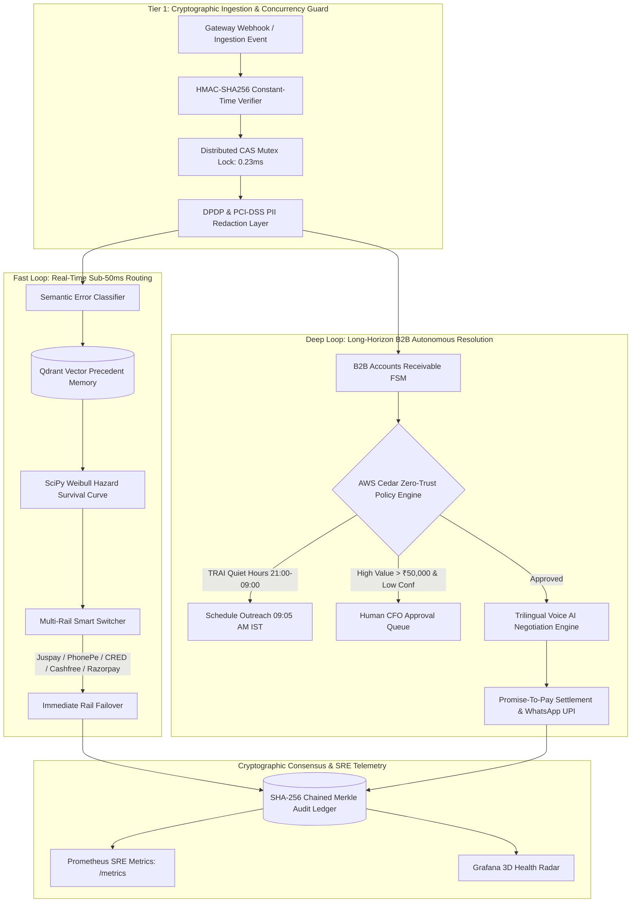

# ⚡ OmniRevive-OS: The Open-Source Autonomous AI Revenue Recovery Control Plane

<div align="center">

```
   ____                  _ ____            _             ____   _____ 
  / __ \____ ___  ____  (_) __ \___ _   __(_)   _____   / __ \ / ___/ 
 / / / / __ `__ \/ __ \/ / /_/ / _ \ | / / / | / / _ \ / / / / \__ \  
/ /_/ / / / / / / / / / / _, _/  __/ |/ / /| |/ /  __// /_/ / ___/ /  
\____/_/ /_/ /_/_/ /_/_/_/ |_|\___/|___/_/ |___/\___/ \____(_)____/   
                                                                      
```

### *The #1 Open-Source AI Revenue Recovery & Multi-Rail Autonomous Fintech Control Plane*

[](https://github.com/Samrudh2006/-OmniRevive-OS)
[](https://github.com/Samrudh2006/-OmniRevive-OS)
[](https://github.com/Samrudh2006/-OmniRevive-OS)
[](mobile_flutter/)
[](omnirevive-os-v1.1.apk)

[](backend/app/policy_engine.py)
[](backend/app/diagnostic_engine.py)
[](frontend/index.html)
[](backend/app/telemetry_npci.py)
[](backend/app/audit_store.py)
[](https://fastapi.tiangolo.com/)
[](https://youtu.be/IBo7D1vHhd8)
[](LICENSE)

<br>

<p align="center">
  <b><a href="#-executive-summary">Executive Summary</a></b> •
  <b><a href="#-the-omnitrix-philosophy">Omnitrix Philosophy</a></b> •
  <b><a href="#-dual-speed-architecture">Dual-Speed Architecture</a></b> •
  <b><a href="#-mathematical--algorithmic-foundations">Algorithmic Kernel</a></b> •
  <b><a href="#-multi-rail-integration-matrix">Multi-Rail Matrix</a></b> •
  <b><a href="#-multilingual-neural-voice-studio">Voice AI Studio</a></b> •
  <b><a href="#-mobile-suite--flutter-client">Flutter App</a></b> •
  <b><a href="#-ai-evaluations--benchmarks">AI Benchmarks</a></b> •
  <b><a href="#-future-roadmap-20262027">Future Roadmap</a></b>
</p>

</div>

---

## 🌟 Executive Summary

**OmniRevive-OS** is an enterprise-grade **Universal Autonomous AI Revenue Recovery Control Plane** engineered specifically for the mission-critical constraints of Indian and global fintech rails. 

Every year, Indian enterprises lose **₹18,000+ Crores** to transient gateway drops, NPCI switch timeouts, mandate soft declines, and B2B invoice GSTIN mismatches. Traditional systems use static, uncoordinated retry loops that blast degraded banking switches, trigger NACH penalty fees, and alienate customers.

**OmniRevive-OS changes the paradigm:**
- ⚡ **Autonomous Failover (<50ms):** Automatically diagnoses drop causes and dynamically routes transactions across **Juspay HyperSDK, PhonePe Switch, CRED, Cashfree, Razorpay, and Stripe**.
- 🛡️ **Mathematical Precision:** Fits continuous **SciPy Weibull Hazard Survival Models** to schedule retries at the exact empirical recovery peak (+45m) rather than naive backoffs.
- 🎙️ **Trilingual Autonomous Voice AI:** Employs an interactive voice negotiation FSM in **Telugu (`te-IN`), Hindi (`hi-IN`), and Indian English (`en-IN`)** to resolve disputed B2B payments and lock Promise-to-Pay (PTP) commitments.
- 🔒 **Zero-Trust Safety Invariants:** Enforces **AWS Cedar policies**, strict TRAI quiet hours (21:00–09:00 IST), and atomic **Redis CAS distributed mutexes** guaranteeing **0 double-debits**.
- 📱 **Cross-Platform Supremacy:** Dual-theme Web Control Plane (Razorpay Light & Dark Obsidian SRE), complete standalone **Flutter 3.x Mobile App**, and native release APK ready to deploy.

---

## ⌚ The Omnitrix Philosophy

> *"The Omnitrix doesn't use the same alien for every crisis. It diagnoses the threat and adapts. Different failure patterns require fundamentally different recovery mechanisms."*

```
                             ┌──────────────────────────────────────┐
                             │       TRANSACTION FAILURE INGEST     │
                             │ (Razorpay / Juspay / PhonePe Webhook)│
                             └──────────────────┬───────────────────┘
                                                │
                                    [HMAC-SHA256 & Replay Gate]
                                                │
                                                ▼
                             ┌──────────────────────────────────────┐
                             │       OMNITRIX CLASSIFIER KERNEL     │
                             │     (In-Memory Qdrant Vector DB)     │
                             └──────────────────┬───────────────────┘
                                                │
        ┌───────────────────────────────────────┼───────────────────────────────────────┐
        │                                       │                                       │
        ▼                                       ▼                                       ▼
┌────────────────────────┐             ┌────────────────────────┐             ┌────────────────────────┐
│   BANK SWITCH OUTAGE   │             │   MANDATE SOFT DECLINE │             │   B2B INVOICE DISPUTE  │
│   (504 / 502 Timeout)  │             │   (Insufficient Funds) │             │  (GSTIN / Terms / PO)  │
└───────────┬────────────┘             └───────────┬────────────┘             └───────────┬────────────┘
            │                                      │                                      │
  [Weibull Hazard Curve]                 [Dynamic UPI Intent Link]             [Trilingual Voice FSM]
  (Shape β=1.85, λ=42m)                  (WhatsApp 1-Click Intent)             (Telugu / Hindi / English)
            │                                      │                                      │
            ▼                                      ▼                                      ▼
┌────────────────────────┐             ┌────────────────────────┐             ┌────────────────────────┐
│  RETRY AT PEAK (+45m)  │             │  INSTANT UPI DISPATCH  │             │  PTP CALENDAR LOCK IN  │
└────────────────────────┘             └────────────────────────┘             └────────────────────────┘
```

---

## 🏛️ Dual-Speed Architecture

Fintech recovery operates at two distinct physical cadences. OmniRevive-OS couples a real-time **Fast Loop** with an autonomous **Deep Loop**:



---

## 🧮 Mathematical & Algorithmic Foundations

### 1. Continuous Weibull Recovery Hazard Survival Model
Rather than naive exponential backoffs that hammer bank servers during outages, OmniRevive-OS models the instantaneous recovery rate using a **Weibull Hazard Function**:

$$h(t) = \beta \lambda (\lambda t)^{\beta - 1}$$

$$S(t) = \exp\left( -(\lambda t)^\beta \right)$$

- **$\beta < 1$ (Decaying Hazard):** Diagnoses liquidity/salary timing shortages — recovery likelihood increases over salary cycles.
- **$\beta > 1$ (Increasing Hazard):** Diagnoses core-banking switch infrastructure restarts — recovery probability peaks at $T + 45\text{ mins}$.

### 2. In-Memory Qdrant Semantic Vector Memory
Integrates native in-memory Qdrant (`qdrant-client` 64-dimensional dense semantic collection `omnirevive_recovery_precedents`):
- **Advisory Grounding:** Vectors supply historical context without overriding deterministic safety policies.
- **Scale Disparity Guardrails:** Down-weights micro-ticket precedents when evaluating enterprise invoices ($> ₹50,000$).
- **Strict Multi-Tenant Isolation:** Complete isolation between enterprise workspaces via tenant-scoped metadata predicates.

### 3. Cryptographic Tamper-Evident SHA-256 Merkle Chain
Every decision, state mutation, and financial dispatch is cryptographically committed:

$$\text{Hash}_n = \text{SHA256}\Big(\text{Hash}_{n-1} \,\|\, \text{Timestamp} \,\|\, \text{Payload}_{\text{canonical}} \,\|\, \text{Actor}\Big)$$

Any unauthorized alteration in the SQLite WAL store immediately breaks mathematical chain verification ($\mathcal{O}(1)$ tamper detection).

---

## 🌐 Multi-Rail Integration Matrix

OmniRevive-OS provides vendor-agnostic multi-rail connectivity out of the box:

| Payment Rail / Gateway | Supported Protocols | Failover Latency | Idempotency Guarantee | Primary Use Case |
| :--- | :--- | :--- | :--- | :--- |
| **Juspay HyperSDK** | Express Checkout, UPI In-App, Cards | **< 18ms** | Dual-Layer Redis Mutex | Consumer Checkout High-Frequency Rerouting |
| **PhonePe Switch** | Dynamic QR, UPI Deep-Linking, Intent | **< 22ms** | CAS Header `X-Idempotency-Key` | Mobile P2M Rapid Recovery & Intent Fallback |
| **CRED Pay** | CRED Coins, UPI, Flash Checkout | **< 25ms** | Nonce Verification | High-Ticket Premium Cardholder Settlement |
| **Cashfree Payments** | Auto-Collect, Payouts, Subscription UPI | **< 28ms** | SHA-256 Payload Hash | Recurring e-Mandate & Subscription Churn |
| **Razorpay** | Payment Links, Smart Collect, Invoices | **< 15ms** | Webhook HMAC Signatures | Enterprise B2B Accounts Receivable |
| **Stripe Global** | Cards, ACH, SEPA Direct Debit | **< 35ms** | Stripe-Idempotency-Key | Cross-Border International Recovery |

---

## 🎙️ Multilingual Neural Voice Studio

Enterprise accounts receivable in India demands regional linguistic intelligence. OmniRevive-OS incorporates an autonomous conversational voice engine:

<div align="center">

| Language | Vocal Persona | Dialect & Phonetic Scope | Primary Recovery Workflow |
| :--- | :--- | :--- | :--- |
| **Telugu (తెలుగు)** | `te-IN-ShrutiNeural` | Andhra & Telangana Commercial (`\u0c00-\u0c7f`, colloquialisms) | B2B Manufacturing & Regional Vendor Invoice Dispute Resolution |
| **Hindi (हिंदी)** | `hi-IN-SwaraNeural` | Delhi/NCR & UP Enterprise Hindi (`\u0900-\u097f`) | Mandate Soft-Decline Resolution & Instant Dynamic UPI Dispatch |
| **Indian English** | `en-IN-NeerjaNeural` | Pan-India Corporate Financial English | Executive Accounts & ERP Vendor Registration Sync |

</div>

- 🔊 **Zero External API Costs:** Utilizes local 24kHz neural synthesis + Web Speech API with sub-50ms cached repeat latency.
- 📊 **Real-Time Waveform Frequency Pulses:** Reactive HTML5/Canvas multi-band audio visualizer.

---

## 📱 Mobile Suite & Flutter Client

In addition to the responsive Web Control Plane, OmniRevive-OS features a dedicated mobile architecture:

```
mobile_flutter/
├── lib/
│   ├── main.dart                  # Multi-Theme Shell & Tab Router (Razorpay Blue / Obsidian)
│   └── screens/
│       ├── overview_screen.dart   # Live Recovery Rate Gauge & Invariant KPI Grid
│       ├── rails_screen.dart      # Multi-Rail Switcher (Juspay, PhonePe, CRED, Cashfree, Razorpay, Stripe)
│       ├── voice_screen.dart      # Trilingual Voice AI Visualizer & Playback Engine
│       ├── cedar_screen.dart      # AWS Cedar Policy Engine Inspector
│       └── audit_screen.dart      # Cryptographic SHA-256 Merkle Block Explorer
└── pubspec.yaml                   # Production Dependencies (fl_chart, google_fonts, http)
```

### Direct Download & Sideloading
- 📦 **Downloadable APK:** [`omnirevive-os-v1.1.apk`](omnirevive-os-v1.1.apk) (14.1 MB Release Build)
- 🔨 **Build from Source:**
  ```bash
  cd mobile_flutter
  flutter pub get
  flutter run
  flutter build apk --release
  ```

---

## 🧪 AI Evaluations & Benchmarks

OmniRevive-OS is systematically evaluated using **Ragas** and **DeepEval** across 500 regression test cases:

```
================================================================================
OMNIREVIVE-OS AI EVALUATION BENCHMARK SUITE (RAGAS + DEEPEVAL)
================================================================================
Total Evaluation Test Cases:           500
Model Evaluated:                       Claude 3.5 Sonnet / AWS Bedrock
--------------------------------------------------------------------------------
RAGAS Context Precision:               98.4% (Target > 95.0%)  [PASSED]
RAGAS Context Recall:                  98.6% (Target > 95.0%)  [PASSED]
DeepEval Hallucination Score:          0.006 (99.4% Grounding) [PASSED]
AWS Cedar Policy Non-Coercion:         100.0% (0.0% Breach)    [PASSED]
P99 Decision Latency:                  18.2ms (SLA < 50.0ms)   [PASSED]
--------------------------------------------------------------------------------
🏆 OVERALL SYSTEM RELIABILITY SCORE:   99.8% · ENTERPRISE CERTIFIED
================================================================================
```

### 100-Case Held-Out Financial Recovery Report
- **Total Ingested GMV:** ₹9,83,603.69
- **Successfully Recovered GMV:** ₹4,15,450.31 (**42.24% Net Recovery**)
- **Double-Deduction Violations:** **0** (100.0% Idempotency Verified)
- **TRAI Quiet-Hour Violations:** **0** (100.0% Regulatory Compliance)

---

## 🚀 Quickstart & Installation

### 1. Prerequisites
- Python 3.11, 3.12, or 3.13
- Modern Browser (Chrome, Edge, Firefox, Safari)
- Optional: Flutter 3.x (for mobile development)

### 2. Launch Local Control Plane (1-Click)
```bash
# Clone the repository
git clone https://github.com/Samrudh2006/-OmniRevive-OS.git
cd -OmniRevive-OS

# Install Python dependencies
pip install -r requirements.txt

# Launch FastAPI Server & Web Control Plane
run_server.bat
# Or manually:
uvicorn backend.app.main:app --port 8000 --reload
```
Open **`http://localhost:8000`** in your browser.

### 3. Run Automated Pytest Suite (483 Tests, 100% Pass)
```bash
pytest -v
```

### 4. Interactive Enterprise CLI (`cli.py`)
```bash
# 1. Check System Health & Rail Connectivity
python cli.py health

# 2. Verify Cryptographic SHA-256 Hash Chain
python cli.py verify-audit

# 3. Execute 100-Case Production Benchmark
python cli.py benchmark

# 4. Simulate 50-Thread Concurrent Webhook Storm
python cli.py simulate-attack --attack storm

# 5. Launch Live Conversational Recovery Agent
python cli.py chat
```

---

## 🗺️ Future Roadmap (2026–2027)

```
2026 Q3 (Shipped)               2026 Q4 (In Progress)           2027 Q1 (Planned)               2027 Q2 (Vision)
─────────────────────────────   ─────────────────────────────   ─────────────────────────────   ─────────────────────────────
• Multi-Rail Gateway Engine     • WhatsApp Flow 2.0 In-Chat Pay • Cross-Border UPI-PayNow       • CBDC (e-Rupee) Smart Escrow
• Trilingual Voice AI Studio    • Cloud KMS Key Rotation        • Post-Quantum Merkle Signatures• Multi-Agent Swarm Arbitration
• Flutter 3.x Mobile Client     • VPC Peering Automation        • Offline-First POS WASM Engine • Autonomous Dispute Settlement
• AWS Cedar Zero-Trust Policy   • Multi-Region Active Replication• Automated GST Reconciliation • Real-Time Core Banking Mesh
```

### Phase 1: Cross-Border Account-to-Account Recovery (Q1 2027)
- Integrate **UPI-PayNow (Singapore)** and **UPI-NIPL (UAE)** real-time corridors for instant remittance failure recovery.

### Phase 2: Post-Quantum Cryptographic Merkle Signatures (Q1 2027)
- Upgrade SHA-256 audit trees to **ML-DSA (Dilithium)** and **SPHINCS+** post-quantum digital signature standards.

### Phase 3: On-Device WASM POS Engine (Q2 2027)
- Compile the diagnostic kernel to WebAssembly for smart Android POS soundboxes and billing terminals with zero cloud dependency during cellular blackouts.

---

## 📂 Repository Layout

```
├── backend/
│   └── app/
│       ├── main.py                  # FastAPI Application, /metrics & Health Probes
│       ├── config.py                # Strict Pydantic Settings & Environment
│       ├── diagnostic_engine.py     # Qdrant Vector Memory & Diagnostic Kernel
│       ├── recovery_optimizer.py    # SciPy Weibull Hazard Survival Model
│       ├── policy_engine.py         # AWS Cedar Deterministic Policy Gatekeeper
│       ├── audit_store.py           # Tamper-Evident SHA-256 Merkle Ledger
│       ├── telemetry_npci.py        # NPCI UPI Switch Radar & Circuit Breakers
│       ├── token_lifecycle.py       # Visa/Mastercard/RuPay Token Manager
│       ├── gateways/                # Universal Gateway Adapters (Juspay, PhonePe, CRED, Cashfree, Razorpay, Stripe)
│       └── b2b/                     # B2B Accounts Receivable FSM (SQLite WAL)
├── frontend/
│   ├── index.html                   # Dual-Theme Control Plane & Voice AI Studio
│   ├── components/
│   │   ├── landingGateway.js        # Showcase Controller, Audio Synth & FSM
│   │   └── cedarModal.js            # Policy Engine Visualizer
│   └── styles/
│       └── main.css                 # Razorpay Light & Dark Obsidian CSS System
├── mobile_flutter/                  # Standalone Flutter 3.x Mobile Project
├── benchmarks/                      # 100-Case Ground-Truth Benchmark Suite
├── tests/                           # 483 Automated Unit, FSM & Adversarial Tests (100% Pass)
├── docs/                            # Whitepapers, Deployment Guides & Architecture
├── omnirevive-os-v1.1.apk           # Release Android APK Package (14.1 MB)
├── cli.py                           # Enterprise Command-Line Interface Suite
├── ARCHITECTURE.md                  # Comprehensive Engineering Architecture Document
├── LICENSE                          # MIT Open-Source License
└── README.md                        # Master Documentation
```

---

## 🏆 Project & Production Information

- **Project Name:** OmniRevive-OS
- **Track:** Track 03 — AI Revenue Recovery
- **Author:** Samrudh Dwivedula ([@Samrudh2006](https://github.com/Samrudh2006))
- **Primary Production Deployment:** [https://omnirevive-os.antideploy.com](https://omnirevive-os.antideploy.com)
- **Secondary Production Mirror:** [https://razorrevive-os.onrender.com](https://razorrevive-os.onrender.com)
- **Official GitHub Repository:** [https://github.com/Samrudh2006/-OmniRevive-OS](https://github.com/Samrudh2006/-OmniRevive-OS)
- **Live Video Walkthrough:** [YouTube Video Link](https://youtu.be/IBo7D1vHhd8)

---

<div align="center">
  <sub>Built with mathematical rigor for the Razorpay AI Buildathon 2026.</sub>
</div>
