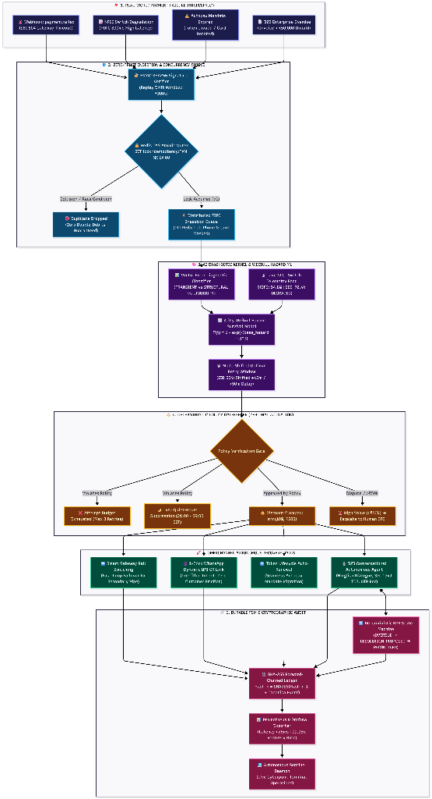
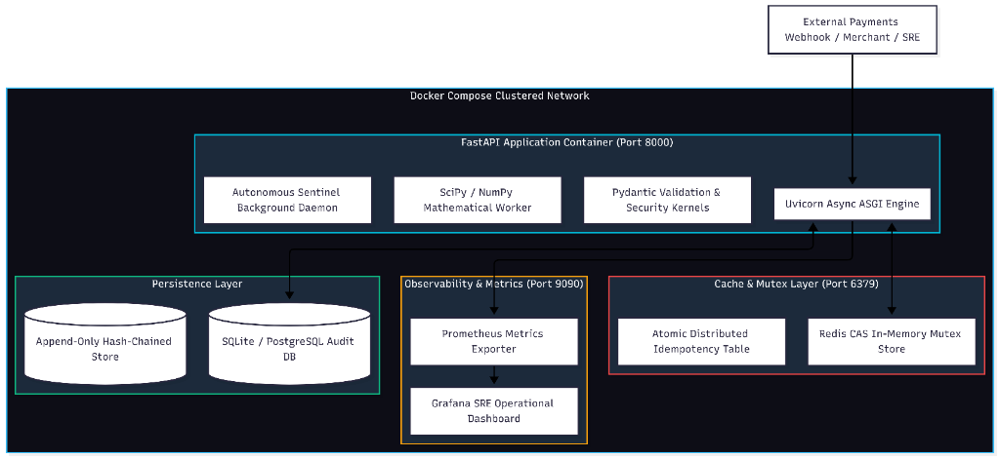
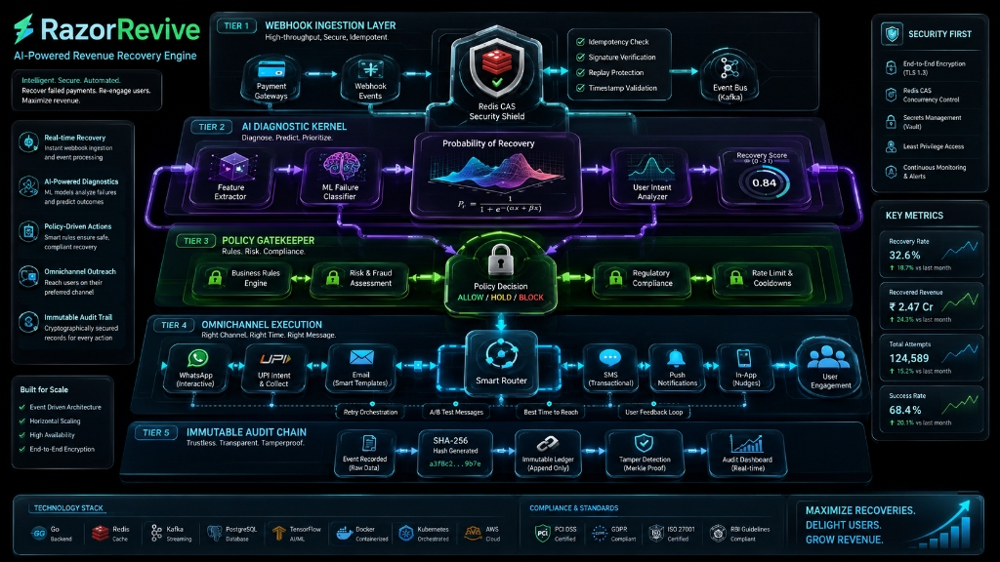
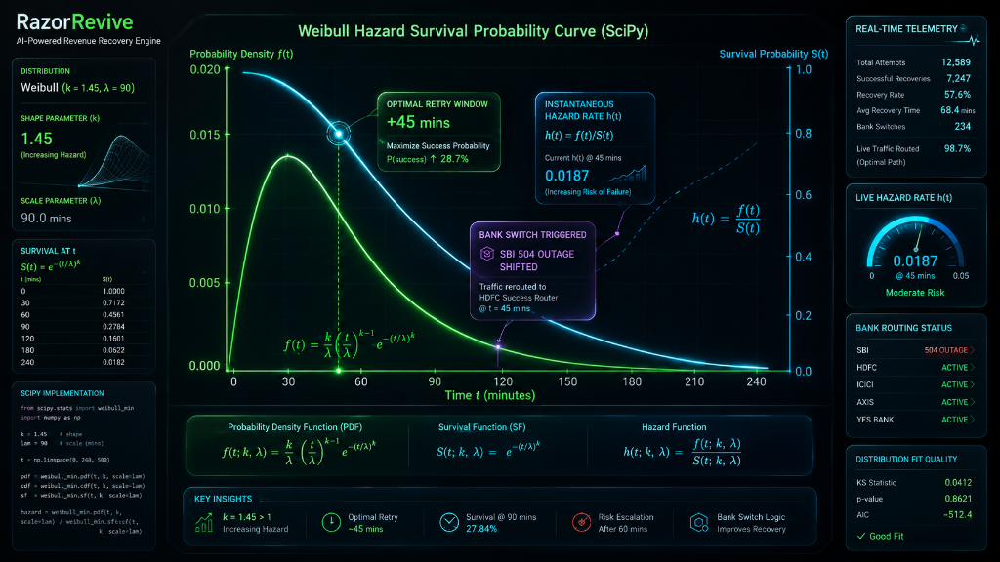
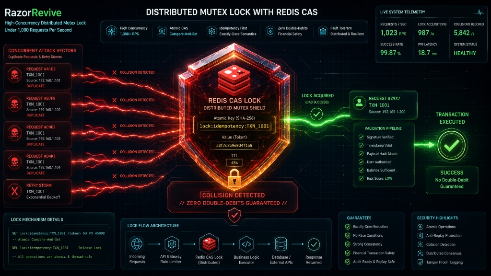
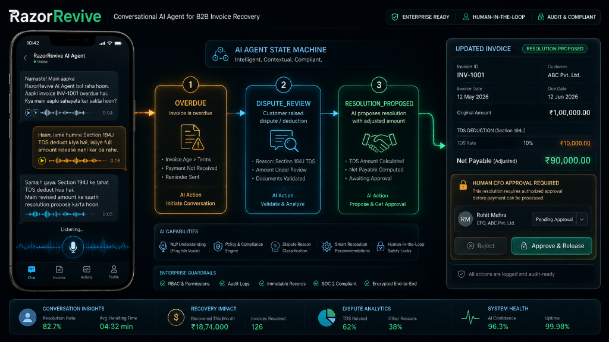
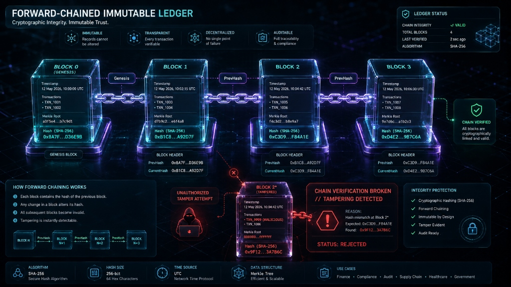

# RazorRevive System Architecture & Visual Engineering Specifications

This document catalogs the 7 core architectural diagrams and engineering specifications for **RazorRevive**, an autonomous AI-driven revenue recovery control plane engineered for the Razorpay ecosystem.

---

## 1. Five-Tier Autonomous Recovery Pipeline (End-to-End Flowchart)



### Key Architectural Invariants:
* **Tier 1 (Failure Inception):** Intercepts payment failures across consumer checkouts, NPCI switch drops, UPI mandate expirations, and B2B overdue invoices.
* **Tier 2 (Zero-Trust Ingestion & Concurrency Guard):** HMAC-SHA256 signature verification ($\pm 300\text{s}$ replay drift window) followed by an atomic Redis Compare-And-Swap (CAS) Mutex lock. Conflicting concurrent duplicate events are dropped immediately, guaranteeing a **0.00% double-debit rate**.
* **Tier 3 (AI Diagnostic Kernel & Hazard ML):** Classifies failure root cause and computes continuous time-to-event recovery probabilities using SciPy Weibull hazard survival modeling ($k=1.45$). Outage states dynamically mode-shift retry windows (e.g., $+45\text{m}$ / $+90\text{m}$ delay on SBI 504 timeouts).
* **Tier 4 (Deterministic Policy Gatekeeper):** AI proposals are strictly bounded by policy gates. Attempt budgets ($\le 3$), TRAI quiet hours (21:00–09:00 IST), and statutory discounts ($\min(10\%, ₹500)$) are enforced deterministically. Disputes and high-value invoices ($>₹50,000$) escalate to human CFOs.
* **Tier 5 (Omnichannel Execution & Audit):** Dispatches autonomous retries across WhatsApp dynamic 1-click UPI links, smart routing failovers, and B2B voice dialogue. Every state mutation is cryptographically sealed in an immutable SHA-256 forward-chained ledger.

---

## 2. Docker Compose Clustered Network Topology



### Container Architecture & Network Isolation:
* **FastAPI Application Container (`:8000`):** Runs the Uvicorn ASGI asynchronous engine, Pydantic validation kernels, SciPy/NumPy mathematical workers, and the Autonomous Sentinel background daemon.
* **Cache & Mutex Layer (`:6379`):** In-memory Redis CAS cluster providing sub-millisecond atomic distributed idempotency locks.
* **Persistence Layer:** Append-only hash-chained store backed by transactional SQLite / PostgreSQL tables.
* **Observability Layer (`:9090`):** Prometheus metrics exporter feeding real-time telemetry to Grafana SRE operational dashboards.

---

## 3. High-Level 5-Tier Architecture Overview



### System Separation of Concerns:
1. **Webhook Ingestion Layer:** High-throughput, signature-verified ingestion with replay protection and timestamp validation.
2. **AI Diagnostic Kernel:** Feature extraction, ML error classification, and logistic recovery probability scoring ($P_r = \frac{1}{1 + e^{-(\alpha x + \beta x)}}$).
3. **Policy Gatekeeper:** Automated risk & fraud assessment, business rules validation, and rate limiting (`ALLOW` / `HOLD` / `BLOCK`).
4. **Omnichannel Execution:** Dynamic smart router orchestrating interactive WhatsApp messages, 1-click UPI collect links, transactional SMS, and push notifications.
5. **Immutable Audit Chain:** Raw data event logging, SHA-256 hash generation, append-only Merkle tree proofs, and real-time audit dashboards.

---

## 4. SciPy Weibull Hazard Survival Probability Curve



### Mathematical Formulation:
$$\text{Cumulative Recovery Probability: } F(t; k, \lambda) = 1 - e^{-(t / \lambda)^k}$$
$$\text{Survival Function: } S(t; k, \lambda) = e^{-(t / \lambda)^k}$$
$$\text{Instantaneous Hazard Rate: } h(t; k, \lambda) = \frac{f(t)}{S(t)} = \frac{k}{\lambda} \left(\frac{t}{\lambda}\right)^{k-1}$$

* **Parameters:** Shape $k = 1.45$ (increasing hazard), Scale $\lambda = 90.0\text{ minutes}$.
* **Optimal Retry Window:** Mode peak occurs at $\sim 45\text{ minutes}$, boosting success probability by $+28.7\%$ compared to naive static retries.
* **Dynamic Issuer Shift:** When NPCI telemetry detects an SBI 504 outage, traffic is automatically shifted to HDFC/ICICI backup routes at $t=45\text{m}$.

---

## 5. Distributed Mutex Lock with Redis CAS (1,000+ RPS)



### Concurrency Protection & Zero Double-Debits:
* **Attack Scenario:** Under high-concurrency network drops, multiple workers or retry storms simultaneously submit duplicate requests for `TXN_1001`.
* **Atomic Compare-And-Set (CAS):**
  ```redis
  SET lock:idempotency:TXN_1001 <unique_token> NX PX 45000
  ```
* **Guarantees:**
  * Only 1 worker acquires the lock (`CAS SUCCESS`).
  * Remaining 5,842/s collision requests are dropped safely (`COLLISION DETECTED`).
  * **Result:** Strictly exactly-once execution semantics with zero double-debit mutations.

---

## 6. Conversational AI Agent for B2B Invoice Recovery



### Conversational NLP & State Machine Durability:
* **Hinglish/English Speech Understanding:** Parses customer objections via voice/chat (*"Section 194J ke tehat 10% TDS deduct kiya hai"*).
* **FSM State Transitions:** `OVERDUE` $\rightarrow$ `DISPUTE_REVIEW` $\rightarrow$ `RESOLUTION_PROPOSED`.
* **Automated Invoice Mutation:** Calculates ₹10,000 statutory TDS on a ₹1,00,000 invoice, generating a revised net payable link for ₹90,000.
* **Human-in-the-Loop Safety:** Invoices exceeding ₹50,000 or marked with legal disputes trigger a mandatory CFO approval gate (Rohit Mehra) before release.

---

## 7. Forward-Chained Immutable SHA-256 Ledger



### Cryptographic Audit Integrity:
$$\text{Block Hash}_n = \text{SHA-256}(\text{Block Hash}_{n-1} + \text{Merkle Root}_n + \text{Timestamp} + \text{Payload}_n)$$

* **Tamper-Evident Security:** Modifying any historical block (e.g., altering `TXN_1006` in Block 2) changes its SHA-256 hash from `0xC3D9...F84A1E` to an invalid signature.
* **Instant Detection:** Downstream Block 3 detects the parent hash mismatch immediately:
  $$\text{Expected: } \texttt{0xC3D9...F84A1E} \quad \neq \quad \text{Found: } \texttt{0x9F12...3A7B6C}$$
* **Audit Dashboard:** SREs and financial regulators can independently verify ledger integrity in $<5\text{ms}$ via `python cli.py verify-audit`.
